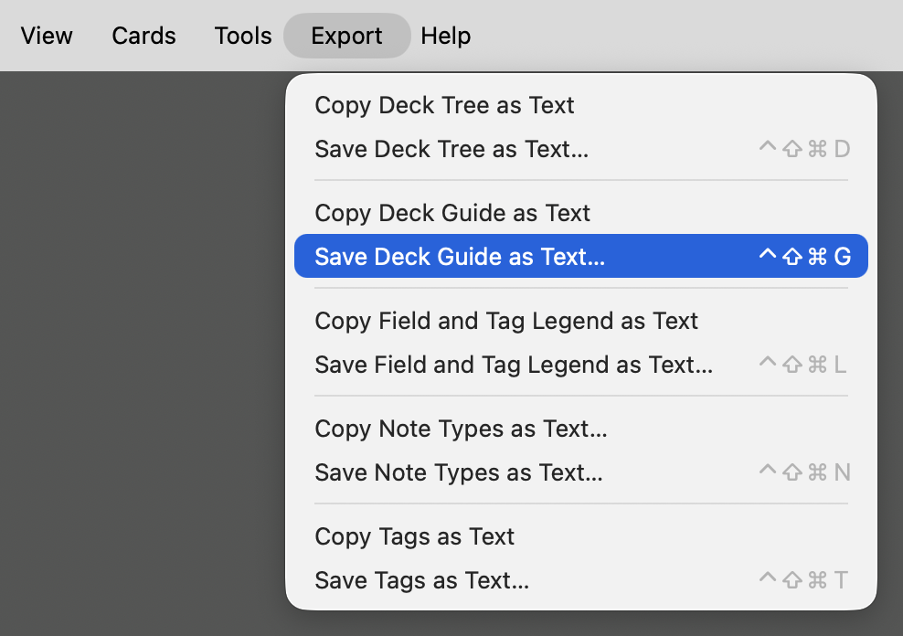
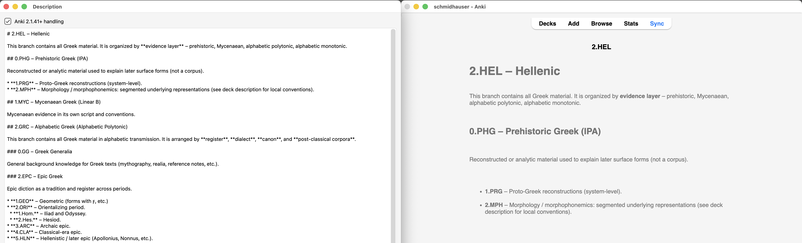

# Export Deck Guide as Text

Systematically organized Anki collections often encode substantial information in their deck names and hierarchies through abbreviations, numbering, and local conventions. While a deck tree can show the existence of a full deck path such as `2.HEL::2.GRC::4.CAT::2.PRO::1.PHS::2.Ar.`, it does not by itself explain what the abbreviations mean, why the hierarchy is divided as it is, or what belongs in each branch.

The deck **Description** provides a natural place for such documentation, as it is attached directly to the deck it describes, can be inspected and edited within Anki, and always stays with the collection. This add-on exports all non-empty descriptions as structured text, either to the clipboard or to a file. Each description is associated with the deck’s full path and marked according to whether Anki uses Markdown (“Anki 2.1.41+ handling”) or legacy HTML handling for it. The exported text can serve as a collection-wide deck guide for inspection or—above all—for use as context for an LLM.

**[Export Deck Guide as Text](https://github.com/schmidhauser/anki-export-deck-guide-as-text)** complements **[Export Deck Tree as Text](https://github.com/schmidhauser/anki-export-deck-tree-as-text)**, **[Export Field and Tag Legend as Text](https://github.com/schmidhauser/anki-export-field-tag-legend-as-text)**, **[Export Note Types as Text](https://github.com/schmidhauser/anki-export-note-types-as-text)**, and **[Export Tags as Text](https://github.com/schmidhauser/anki-export-tags-as-text)**. Together, these five add-ons provide collection-level context. In the Browser, **[Selected Notes to Structured Text](https://github.com/schmidhauser/anki-selected-notes-to-structured-text)** supplies the selected notes to which that context can be applied, whether for assessment or as exemplars for note generation.

## Installation

Install **Export Deck Guide as Text** from [AnkiWeb](https://ankiweb.net/shared/info/xxx) using add-on code `xxx`.

## Usage



Choose either of the following menu items:

* **Export → Copy Deck Guide as Text**
* **Export → Save Deck Guide as Text…**

Both commands export the same collection-wide deck guide: **Copy Deck Guide as Text** places it on the clipboard; **Save Deck Guide as Text…** writes it to a UTF-8 text file, by default named `anki-deck-guide-YYYY-MM-DD.txt`.

The export contains normal decks only: filtered decks are excluded, and decks with empty descriptions are omitted. Descriptions remain in Anki’s deck ordering.

Deck descriptions can be edited in Anki’s **Description** window. With **Anki 2.1.41+ handling** enabled, the description is stored as Markdown and rendered by Anki accordingly.



The add-on only reads deck metadata; it does not modify the collection.

## Configuration

The keyboard shortcuts can be changed in the add-on’s configuration dialog:

**Tools → Add-ons → 𝕾 Export Deck Guide as Text → Config**

The default configuration is:

```json
{
    "shortcut_copy": "",
    "shortcut_save": "Meta+Ctrl+Shift+G"
}
```

`shortcut_copy` is disabled by default.

On macOS, Qt interprets `Meta` as Control (`⌃`), `Ctrl` as Command (`⌘`), `Alt` as Option (`⌥`), and `Shift` as `⇧`. The default shortcut for **Save Deck Guide as Text…** is therefore `⌃⇧⌘G`.

No restart is required.

## Format

The export begins with the number of deck descriptions exported and a short explanation of the format. Each description is then represented by an `anki-deck` block containing the deck’s full path and an `anki-description` block containing the description itself. An example:

```yaml
# ANKI DECK GUIDE

Deck descriptions exported: 2

Each `<@anki-deck>` block contains the description stored for one normal Anki deck with a non-empty description, with leading and trailing whitespace removed. The `format` attribute records whether Anki uses Markdown or legacy HTML handling for that description.

<@anki-deck name="2.HEL"@>
<@anki-description format="markdown"@>
# 2.HEL – Hellenic

This branch contains all Greek material. It is organized by **evidence layer** – prehistoric, …
</@anki-description@>
</@anki-deck@>

<@anki-deck name="2.HEL::0.PHG"@>
<@anki-description format="markdown"@>
# 0.PHG – PREHISTORIC GREEK

`0.PHG` contains **pre-alphabetic / reconstructed / analytic** material used…
</@anki-description@>
</@anki-deck@>
```

The `name` attribute records the deck's full path as identified by Anki. The `format` attribute is `markdown` when **Anki 2.1.41+ handling** is enabled for that description and `html` when Anki uses the legacy handling.

Leading and trailing whitespace is removed from each description; internal text, line breaks, Markdown, HTML, links, Unicode, and other content are otherwise preserved.

The `<@…@>` delimiters make deck and description boundaries explicit without requiring the description contents themselves to be transformed. The format is intended to be straightforward for both humans and LLMs to inspect and parse.

## Compatibility

Tested with Anki 26.08 on macOS Tahoe 26. Windows and Linux have not yet been tested.

Suggestions and bug reports are welcome. Please [open an issue on GitHub](https://github.com/schmidhauser/anki-export-deck-guide-as-text/issues).

## License

Licensed under the [GNU AGPL v3 or later](LICENSE).
